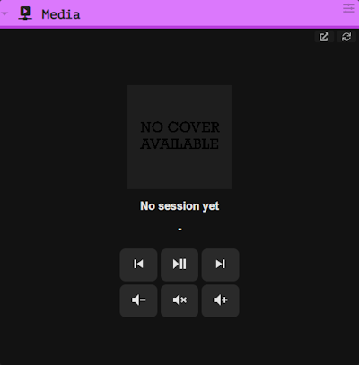
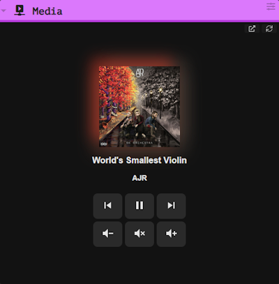
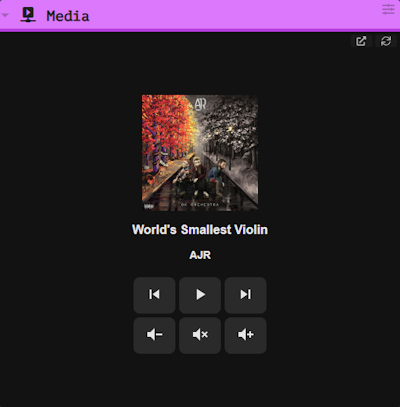

# Widget Multimedia para Windows

### Importante: Este proyecto esta basado en `Python 3.12`

## Variables de entorno

Este proyecto depende de la variable de entorno `MEDIA_API_TOKEN` que se usará para restringir el acceso a clientes autorizados por este token.

Recomendamos generarlos por uno de estos métodos:

1. Python Secrets

```bash
python -c "import secrets; print(secrets.token_urlsafe(32))"
```

2. OpenSSL

```bash
openssl rand -base64 32
```

Sea cual sea el método usado, debes crear la variable de entorno de usuario `MEDIA_API_TOKEN` para que el código funcione.

Otra variable a usar (pero opcional) es `SELF_API_IP`, para solo aceptar conexiones a través de la interfaz especifica, de no encontrarse, se usara la interfaz `0.0.0.0`.

También esta esta variable, que es netamente de desarrollo, `DEBUG`. Esta variable permite habilitar el "hot reload" de los paneles `HTML`.

## Argumentos de programa

Para facilitar la experiencia de desarrollo, se agregó el siguiente argumento:

- `-p`, `--port`: Para definir el puerto del servidor (`25012` por defecto).

De esta manera no es necesario cambiar el puerto manualmente en el código (principalmente cuando ya hay una instancia corriendo como servicio de fondo).

## Media panel

Una de las características principales es la presencia de un panel web, que sirve para visualizar el estado de la reproducción y controlarlo.

El panel posee 3 estados:

### Sin sesión multimedia



Este estado aparece cuando no hay ninguna sesión multimedia reconocida por Windows. Se muestra una caratula por defecto (la misma se usa si no hay caratula disponible en la reproducción) y un mensaje de que no todavía no hay sesión. En este estado el botón `play-pause` tiene un logo combinado por la falta de estado.

### Reproduciendo



Lo mas llamativo de este estado es el poder ver la caratula de la canción o media en reproducción, con un efecto de _Ambilight_, formado por el uso de 4 `box-shadow` que promedian la información de color de un "anillo interno" dividido en cuartos. Gracias a eso se genera ese curioso efecto al rededor de la caratula.

En este estado, el botón `play-pause` tiene el logo de "pausa", representando la acción que va a realizar al presionarse.

### En pausa



Al estar en pausa, se deshabilita el efecto de luz de la caratula, y se cambia el logo del botón `play-pause`.

#### Punto importante

Los botones del panel están mapeados a los end points de [acciones multimedia](#mediaaction), y **siempre están activos**, sin importar el estado.

## GET EndPoints

### `/health`

EndPoint para poder verificar el estado del servicio.

### `/panel`

Donde se expone el [panel HTML](#media-panel) que usa polling para mantener la comunicación continua de la información multimedia.

### `/media/info`

Obtiene la información de la sesión multimedia en curso (de existir).

Hay 2 respuesta posibles:

1. Sin sesión:

```json
{
  "status": "inactive"
}
```

2. Con sesión:

```json
{
   "status": "active",
   "is_playing": is_playing,     // Booleano del estado de reproducción
   "title": media_props.title,   // Titulo de la canción
   "artist": media_props.artist, // Artista de la canción
}
```

### `/media/thumbnail`

Este EndPoint devuelve la imagen de la caratula que se encuentra en memoria de la sesión multimedia.

### `/media/{action}`

Mapeo de los EndPoints hacia su tecla correspondiente en Windows. Este EndPoint requiere la cabecera `X-Token` con el token que hayas configurado en la [variable de entorno](#variables-de-entorno).

| EndPoint   | Tecla virtual |
| ---------- | ------------- |
| `play`     | `playpause`   |
| `pause`    | `playpause`   |
| `vol-up`   | `volumeup`    |
| `vol-down` | `volumedown`  |
| `mute`     | `volumemute`  |
| `next`     | `nexttrack`   |
| `prev`     | `prevtrack`   |
| `stop`     | `stop`        |

## WebSocket EndPoints

### `/ws/panel`

Expone una versión del [panel HTML](#media-panel) que usa WebSockets para mantener la comunicación continua de la información multimedia.

### `/ws/media-info`

WebSocket para la comunicación continua de información de la sesión multimedia. Este EndPoint solo envía un mensaje al haber un cambio con respecto al ultimo mensaje enviado.

Las respuestas del presente WebSocket son las mismas que del EndPoint [`/media/info`](#mediainfo).

### `/ws/thumbnail`

WebSocket para la comunicación continua de la caratula de la sesión multimedia. A diferencia de [`/media/thumbnail`](#mediathumbnail), este EndPoint envía la imagen en formato `Base64` lista para usar directamente en la propiedad `src` de una etiqueta ``.

El mensaje solo sera enviado cuando la imagen actual sea diferente a la ultima enviada.

## Aspectos Técnicos

1. Optimización de memoria y conexiones con WinRT

   En una reciente actualización arreglamos un leak de memoria y se optimizo la comunicación con la API del sistema de Windows (`System Media Transport Control Session Manager`).

   Anteriormente se ejecutaba el método `request_async()` en cada iteración de los WebSockets (aproximadamente 2 veces por segundo). Se observó que, tras varias horas de ejecución, este comportamiento satura los canales de comunicación con Windows y su proceso principal (`explorer.exe`). Para solucionarlo, ahora se instancia un _manager_ global, que reutilizara la conexión existente en cada bucle, evitando saturar los canales con conexiones nuevas.

   Por otro lado, el leak a ocurrido en la función `get_thumbnail_base64()`. Dicha función abre un _stream_ directo a la memoria no administrada de Windows para leer la caratula multimedia. El problema radica en no cerrar los objetos `stream` y `DataReader`, dejando referencias en memoria activas, acumulando las caratulas en cada bucle del WebSocket. Al retener esos recursos, se producía un bloqueo en `explorer.exe` (proceso principal del sistema), que persistía incluso cerrando el script.

   La solución fue implementar una liberación estricta (con `try...finally`) que ejecuta `.close()` al final de cada bucle. El código verifica primero que se haya creado la instancia, para cerrarla correctamente (liberando la RAM y los canales de comunicación con `explorer.exe`)

2. Optimización en el WebSocket de la caratula

   Para evitar saturar el ancho de banda, enviando innecesariamente la caratula repetida, guardamos el hash `md5` de la ultima imagen enviada, y en cada ciclo, comparamos dicho hash con el hash de la imagen actual en memoria. De esta manera podemos comparar ambas imágenes de manera indirecta (en vez de comparar ambas cadenas en `Base64`, lo cual consumiría muchos recursos) y, ademas, evitamos enviar la misma caratula varias veces por el WebSocket.

3. Polling vs WebSocket

   Hay 2 tipos de paneles disponibles, el panel por [Polling](#panel) y el panel por [WebSocket](#wspanel). Aca detallamos sus diferencias técnicas:

   | Polling                                                                       | WebSocket                                                                                                                  |
   | ----------------------------------------------------------------------------- | -------------------------------------------------------------------------------------------------------------------------- |
   | El navegador solicita activamente en busca de cambios.                        | El navegador esta a la espera de lo que envíe el servidor.                                                                 |
   | Consumo elevado del ancho de banda.                                           | Al ser una escucha pasiva, no se consume ancho de banda continuamente.                                                     |
   | Tiempo de actualización fijo, cada X tiempo (1.5s en este caso).              | Hay menor tiempo de respuesta, al estar esperando el mensaje del servidor, es casi inmediato.                              |
   | Para uso de Widget, funciona en "contenido mixto" (incrustado HTTP en HTTPS). | Requiere que el servidor y la pagina donde sera incrustado el widget compartan el mismo protocolo (HTTP o HTTPS en ambos). |

   Principalmente por ese ultimo punto estamos manteniendo el método de Polling, ya que si se desea incrustar el widget con WebSocket en una pagina con HTTPS, el navegador rechazara la conexión insegura HTTP, a no ser que se le otorgue un dominio con certificado SSL valido para el widget.

4. Limitaciones técnicas conocidas
   1. Por la arquitectura de Windows, solo puede existir una sesión multimedia, por lo que el widget siempre mostrara la ultima sesión activa registrada por Windows.
   2. Los navegadores suelen tener comportamientos erráticos con la sesión multimedia de Windows, lo que podría ocasionar que no se vea la caratula correcta, no se obtenga los datos de título y/o artista, o perder directamente la sesión. Para evitar problemas con la perdida de la sesión, los botones multimedia **siempre están disponibles**.
   3. Una situación especifica con el reproductor AIMP. Este reproductor, por defecto, **no tiene integración con Windows**, por lo que se requiere instalar el plugin [Windows 10 Media Control](https://aimp.ru/?do=catalog&rec_id=1097). Sin el plugin, AIMP no podrá enviar la información multimedia a Windows, pero los botones multimedia siguen siendo 100% funcionales (otra de las razones por las que están siempre habilitados).

## Levantar como servicio

Para que este servidor se ejecute cada vez que se inicia sesión, recomendamos seguir esta guía.

Recomendamos que el contenido de este repositorio este en `C:\Scripts\MediaAPI\` ya que los comandos incluidos aca están destinados a dicho scope.

### Preparación del entorno

Por comodidad y aislamiento del servicio, usaremos un entorno virtual de `Python 3.12`.

```bash
python -m venv .venv
```

Y luego instalamos las dependencias en dicho `.venv`:

- Para `bash` en Windows:

```bash
source /c/Scripts/MediaAPI/.venv/Scripts/activate
pip install -r requirements.txt
```

- Para `CMD`:

```bat
C:\Scripts\MediaAPI\.venv\Scripts\activate.bat
pip install -r requirements.txt
```

- Para `PowerShell`:

```powershell
C:\Scripts\MediaAPI\venv\Scripts\Activate.ps1
pip install -r requirements.txt
```

### Crear tarea

Ahora se debe crear la tarea a ejecutarse en el inicio de sesión.

Primero ejecutar `taskschd.msc` (usando `Win` + `R` o el buscador al presionar `Win`). Una vez abierto, seleccionamos en `Acción` y en `Crear tarea...`, para seguir estas instrucciones:

1. `General`: Poner un nombre y seleccionar `Ejecutar solo cuando el usuario haya iniciado sesión`.
2. `Desencadenadores`: Darle en `Nuevo...`
   - `Iniciar la tarea`: `Al iniciar la sesión`.
   - Seleccionar `Cualquier usuario` (recomendado).
   - `Configuración avanzada`: Desmarcar todo excepto la casilla `Habilitado`.
3. `Acciones`: Darle en `Nueva...`
   - `Acción`: `Iniciar un programa`.
   - `Programa o script`: `C:\Scripts\MediaAPI\.venv\Scripts\pythonw.exe` (para inicio sin ventanas que molesten).
   - `Agregar argumentos`: `"C:\Scripts\MediaAPI\main.py"` (con todo comillas).
   - `Iniciar en`: `C:\Scripts\MediaAPI`.
4. `Condiciones`:
   - `Inactivo`: Desmarcar todo.
   - `Energía`: Desmarcar todo.
   - `Red`: Desmarcar todo.
5. `Configuración`:
   - Desmarcar `Detener la tarea si se ejecuta durante más de:`.
   - En el menú desplegable seleccionar: `Detener la instancia existente`.

### Primer despliegue

Por ultimo, para ejecutar la tarea sin reiniciar, seleccionar `Biblioteca del Programador de tareas`, buscar la tarea que acabas de crear, seleccionarla y darle en `Ejecutar`.

Para probar el funcionamiento puedes acceder al endPoint del panel con la IP de tu computadora (o la que hayas apuntado en la variable `SELF_API_IP`) en el puerto `25012`
